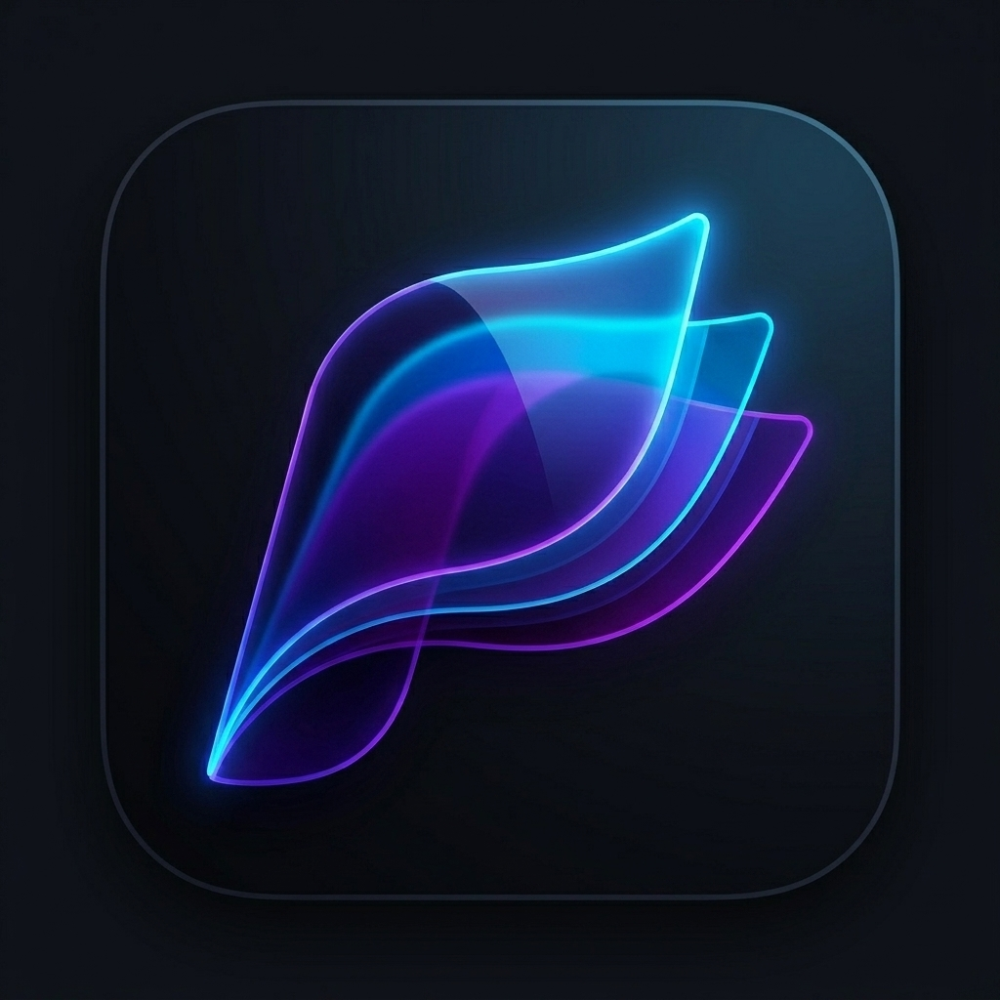

# Glide

**Read more. Fumble less.**
A fast, focused reader for PDFs *and* text files — built for phones, tablets, and foldables.

---

*Open a dozen documents. Pick up exactly where you left off. Every single time.*

---

## Why Glide?

Most readers treat every file like a one-off — reset the zoom, re-find your page, fight
the layout. **Glide treats your documents like a library you actually live in.** Open
many at once as tabs, and every file quietly remembers where you stopped, how you like to
read it, and what you bookmarked. Nothing between you and the page.

And it's built for *today's* devices — it flows across a phone, fills a tablet, and
unfolds with your foldable.

 

- **Multi-document tabs** — open several files and switch between them instantly, like a browser for your books, papers, and manuals.
- **Pin the important ones** — pin tabs and library files to the top so your go-to documents are always one tap away.
- **A real library** — search your collection, and sort by **Name**, **Date added**, **Recently opened**, or **Last modified**.
- **Rich file details** — type, size, page count, location, date added, and last opened, all at a glance.
- **Reading progress on every file** — see exactly how far you are: `p.45 / 500 · 9% · 3.2 MB`.

 

- **Auto-resume** — reopen any document and land on your exact last page.
- **Per-file memory** — each file remembers *its own* page, layout, and reading position — independently.
- **Bookmarks** — mark any page and jump straight back to it whenever you like.

 

- **In-document search** — live find-in-document with quick next / previous match navigation.
- **Table of Contents** — jump through the document's built-in outline.
- **Go to page** — type a page number and you're there.

 

- **Three page layouts** — **Single** (one page at a time), **Double** (two pages side by side), or **Cover** (book-style with a standalone cover page).
- **Layout remembered per file** — your view mode is saved for each document and restored automatically.
- **Smooth zoom & pan** — pinch to zoom up to 8×, double-tap to zoom, and pan freely — without losing your reading position.
- **Immersive reading** — tap to go full-screen and let the page take over.
- **Night mode** — invert page colors for comfortable low-light reading, on top of Glide's clean dark interface.

 

- **Text files too** — open `.txt` documents with a dedicated reading view.
- **Adjustable text size** — bump the font larger or smaller to taste, and Glide remembers your reading position in text files as well.

 

- **Password-protected & encrypted PDFs** — unlock protected documents with a clean password prompt (and a friendly retry if it's wrong).
- **Graceful with bad files** — clear, calm messaging when a file is missing, damaged, or unreadable — no crashes, no confusion.

 

- **Adaptive layout** — tuned for phones, large tablets, and **foldable / dual-screen** devices, so reading always feels right for the display in your hands.

---

## Everything you get

 

 

 

 

 

 

---

### Built with Flutter, powered by a high-performance PDF engine.

**Glide** v1.0.0 — The Modern PDF Viewer.

